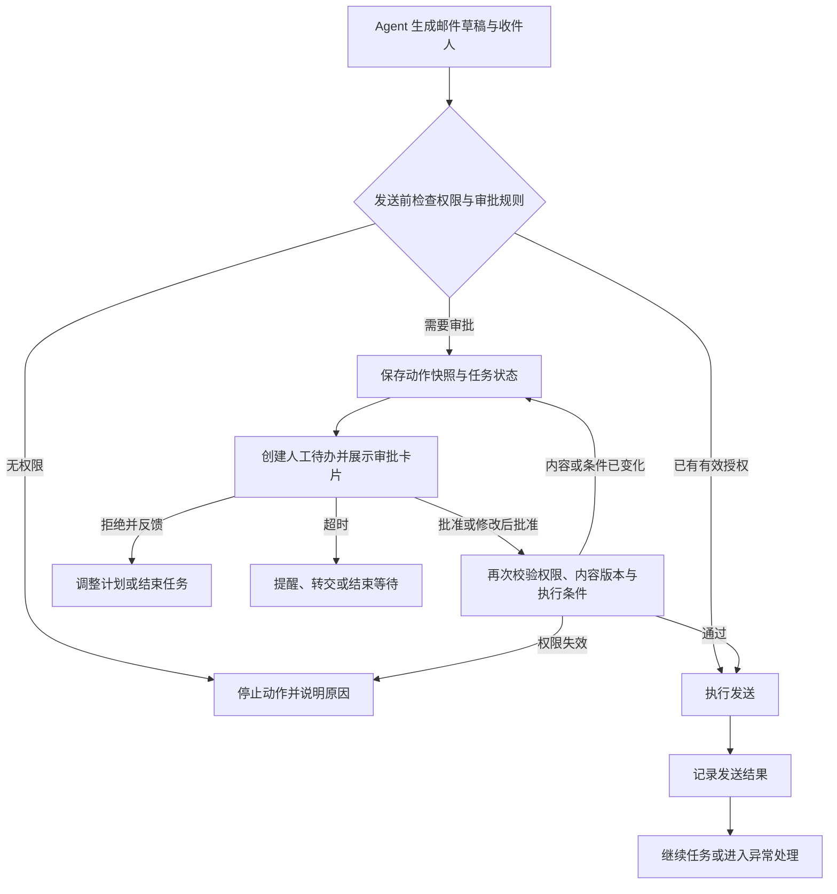
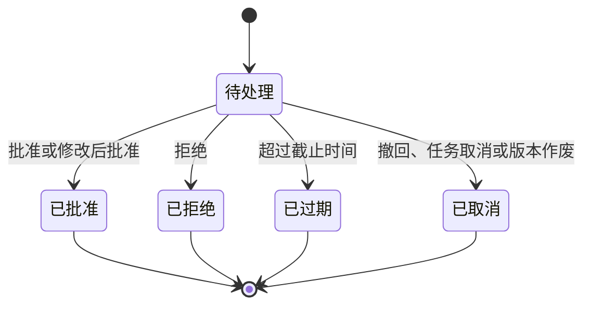

之前写 [LangGraph](/posts/ai-agent-langgraph/) 时，提到过它的 Human in the Loop 能力。最近在设计 Agent 的人工介入功能，发现这里有不少值得单独展开的细节。

Agent 可以查询资料、生成内容，也可以调用工具去修改数据、发送消息、发起业务流程。随着它能做的事情越来越多，我们需要明确：哪些事情可以交给它直接完成，哪些地方需要人补充信息，哪些动作必须由人确认。

一个常见的实现思路是：执行到关键步骤时，弹出一个确认框，用户点“同意”，Agent 接着执行。

沿着这个流程多想一步，问题就来了。用户半小时后才回来怎么办？审批期间内容发生变化怎么办？用户已经同意了，发送接口却超时了，这封邮件到底该不该重发？

HITL 的设计需要覆盖这整段过程：**什么时候暂停，交给谁处理，人基于什么作出决定，以及处理后如何可靠地继续执行。**

这篇文章记录一套通用设计思路，以能够调用工具的业务 Agent 为例。

## 人可以在什么地方介入

我倾向于先把人工介入分成四类。它们可以共享待办、通知、状态保存等基础能力，但交互和后续行为有所不同。

| 介入类型 | 典型场景 | 人提供什么 | Agent 接下来做什么 |
| --- | --- | --- | --- |
| 补充信息 | 缺少客户名称，或存在多个同名对象 | 参数、选择、补充说明 | 校验输入，再继续规划 |
| 执行审批 | 准备发送邮件、删除文件、修改关键字段 | 对具体动作的批准或拒绝 | 执行获批动作，或调整计划 |
| 结果审核 | 报告或回复已经生成，需要审核后发布 | 内容修改、审核意见 | 使用确认后的版本，或重新生成 |
| 人工接管 | 多次失败、超出能力范围，或用户主动介入 | 人工处理结果和交还指令 | 核对当前状态，再决定如何继续 |

这个分类会直接影响产品交互。

补充信息更适合用表单或选项。例如“找到了三个同名客户，请选择本次操作的对象”。用户选完后，Agent 得到了新的业务输入。

执行审批则需要把动作完整呈现出来。例如“将向这个邮箱发送这封邮件”。用户批准的是一个明确的操作。

结果审核要支持阅读、编辑和对比版本。人工接管则需要移交上下文，让处理人知道已经完成了什么，还有什么卡着。

把这些场景都做成一个自由文本输入框，会让后端很难判断用户究竟是在补充信息、修改要求，还是授权执行。涉及实际操作的批准，最好使用明确的按钮，并与具体请求绑定。

## 什么时候需要暂停

触发人工介入，我会保留两个入口。

一类是业务规则：某个工具每次调用都需要审批，修改特定字段需要负责人确认，影响对象超过一定数量需要升级处理。这些条件可以配置在工具、工作流节点或业务策略中。

另一类是 Agent 主动求助：发现必要信息缺失、资料相互矛盾、连续尝试仍然失败时，向人发起请求。

两类入口的约束力度不同。对于强制审批的操作，应在服务端的工具执行入口进行拦截。即便模型没有主动请求审批，工具也不能直接执行。

判断是否需要人介入，可以看四个方面：

- **操作对象**：内部草稿、业务记录，还是外部接收人。
- **影响范围**：修改一条记录，还是批量影响一组对象。
- **可撤销性**：能否恢复原值，已经发送的信息能否收回。
- **已有授权**：用户是否已经对本次操作或明确范围作过授权。

权限与审批也需要分开。审批可以确认某次操作的意图，但不能给原本无权访问的对象增加权限。

查询、整理和生成草稿，可以在授权范围内尽量自动完成。对外发送、删除和关键数据修改，则根据具体业务设置审批条件。这样能把人的注意力留给需要判断的地方。

模型对自身把握程度的描述可以作为求助信号，但强制审批仍然需要明确的规则支撑。

## 用一封邮件串起完整流程

假设用户让 Agent 整理项目进度，然后发给客户。

Agent 先查询资料，形成草稿，再准备调用邮件工具。如果发送行为需要人工审批，就在真正调用工具之前暂停。



这里有一个关键细节：**审批需要发生在动作已经具体化之后、产生外部影响之前。**

只有“给客户发一封邮件”这个计划，还不足以支持审批。用户需要看到收件人、正文和附件。对于批量修改，也应该先展示目标范围和变更内容，再让用户确认。

批准之后，还要检查最终执行内容是否与用户看到的一致。如果 Agent 在等待期间重新生成了正文，之前的批准就不能直接套用到新正文上。

## 审批卡片应该让人看懂什么

一个有用的审批界面，需要帮助人快速理解这次操作的目的、范围和后果。

我会把卡片设计成下面的结构：

```text
等待审批 · 发送项目进度邮件

需要你处理的原因
对外发送邮件需要项目负责人确认。

拟执行内容
收件人：客户 A 的项目联系人，展示完整邮箱
主题：本周项目进度同步
正文：展示完整内容，支持展开和编辑
附件：项目进度表.xlsx，支持查看

相关依据
本周任务记录、项目里程碑和待解决问题

批准后的行为
立即发送当前版本的邮件，并记录发送结果。

[批准并发送]  [编辑内容]  [拒绝并反馈]
```

界面上有几个容易忽略的点。

首先，摘要用于快速浏览，完整内容用于作出决定。批量操作可以展示摘要，但仍应允许查看全部目标和具体差异。

其次，编辑与执行需要明确区分。用户保存编辑后，应能看到最终版本，再点击“批准并发送”。如果修改后的操作超出了当前处理人的权限，就需要转给合适的审批人。

再者，“拒绝”要有清楚的后续语义。用户可以选择让 Agent 根据意见重新规划，也可以结束本次任务。相同动作被拒绝后，不应在下一轮换一种措辞再次提交。

最后，按钮的文字应该对应实际后果。“批准并发送”“确认修改这 12 条记录”比一个泛化的“确定”更容易理解。

在对话之外，还需要一个人工待办中心。用户可能暂时离开会话，处理人也可能是任务发起人之外的同事。待办中心负责展示待处理、已处理和已过期请求，并支持认领、转交和查看上下文。

## 人工请求与 Agent 任务要分别管理状态

到了工程实现，最容易混淆的是“人已经处理完”和“任务已经执行完”。

用户批准发送邮件，只能说明这次动作获得了批准。邮件是否发出，还需要看执行结果。

建议至少区分三个对象：

| 对象 | 需要记录的内容 | 示例状态 |
| --- | --- | --- |
| Agent 任务 | 当前步骤、上下文、恢复位置、等待的请求 | 运行中、等待人工、人工处理中、完成、失败、取消 |
| 人工请求 | 待审动作、内容版本、处理人、截止时间、处理意见 | 待处理、已批准、已拒绝、已过期、已取消 |
| 动作执行 | 实际执行参数、调用标识、外部返回结果 | 未执行、执行中、成功、失败、结果待核实 |

人工请求的状态可以这样流转：



这张图只描述一次人工请求。批准之后的工具执行，属于另一个生命周期。重新生成动作时，应创建新的请求，并保留旧请求的记录。

前端也应该体现这个区别：先展示“已批准，等待执行”，再根据真实结果变成“发送成功”或“发送失败”。如果接口返回超时、无法确定外部系统是否完成操作，应展示“结果待核实”。

## 暂停之后，如何可靠地继续

人工处理可能持续几分钟，也可能隔天才完成。因此，等待状态需要持久化，并且能够跨进程恢复。

任务暂停时，应保存当前上下文、待执行动作、恢复位置和人工请求的关联关系，然后释放执行资源。用户回来处理时，系统根据请求找到对应任务，再调度恢复。

人工请求至少需要关联任务 ID、暂停节点、动作版本、审批内容快照、允许的决策、处理人范围与截止时间。后续还要记录谁在什么时间作出了什么决定，修改过哪些内容，以及实际执行结果。

可靠恢复还有几个具体问题需要处理。

**第一，审批必须绑定到具体内容。** 收件人、正文、附件版本和目标记录等会影响结果的信息，都要包含在审批快照中。必要时保存内容摘要，用于检测变化。仅仅批准一个工具名称，范围太宽。

**第二，恢复时再次校验执行条件。** 等待期间，权限可能被撤销，目标记录可能被其他人修改。对于数据更新，可以利用版本号等并发控制机制，在写入时检查目标是否仍符合审批时的前提。检查与真正写入之间也要避免留下无保护的窗口。

**第三，一次请求只能接受一次有效决策。** 多人同时处理，或者用户重复点击时，需要依靠服务端的原子状态更新来解决竞争。按钮置灰只是界面反馈，最终约束仍然在后端。过期、取消或已处理的请求，应返回当前状态。

**第四，批准记录与恢复调度不能脱节。** 如果数据库已经写入“已批准”，进程却在投递恢复任务前崩溃，Agent 就会一直停着。可以将决策与待投递事件一起持久化，再由后台可靠投递；同时对长期未恢复的已批准请求进行补偿检查。

**第五，恢复和重试要考虑外部动作去重。** 对支持幂等键的接口，使用稳定的动作标识；对不支持的接口，尽量结合外部记录查询和对账。内部记录“只处理过一次审批”，并不能保证第三方系统只执行一次。

还是拿邮件举例：发送请求超时，可能是邮件没发出去，也可能是邮件已经发出、响应没有回来。此时应先核实结果；无法核实时交给人工判断，直接重试可能发出两封邮件。

**第六，拒绝和人工修改都要写回后续上下文。** 用户把收件人改成了另一个联系人，Agent 后面就应基于这个变化继续工作。用户拒绝某个动作时，也要让后续规划知道拒绝原因和允许继续的范围。

如果使用 LangGraph，可以用 `interrupt()` 发起中断，通过 checkpointer 保存状态，并使用同一个 `thread_id` 与 `Command(resume=...)` 恢复。生产环境需要持久化存储。这些机制提供了暂停与恢复的基础。[官方中断文档](https://docs.langchain.com/oss/python/langgraph/interrupts)

还需要特别注意：LangGraph 恢复时，会从中断所在节点的开头重新执行，中断之前的代码也可能再次运行。因此，节点里的外部操作需要做好幂等处理，或拆到能够独立管理执行结果的步骤中。[恢复行为说明](https://docs.langchain.com/oss/python/langgraph/interrupts#resuming-interrupts)

工具调用层面，也可以参考 LangChain HITL 中间件提供的批准、修改、拒绝和直接回复等决策形式。业务上的处理人权限、超时策略和操作记录，还需要应用自己定义。[HITL 中间件文档](https://docs.langchain.com/oss/python/langchain/human-in-the-loop)

## 人工接管需要明确控制权

人工接管比一次审批多了一层含义：接下来的一段工作由人负责。

接管时，应停止 Agent 发起新的业务动作，并展示已经完成、正在执行和等待执行的步骤。对于已经发往外部系统的请求，要说明是否支持取消；接管本身并不能撤回已经发生的操作。

处理人还需要拿到足够的上下文：原始目标、已完成步骤、失败原因、相关资料和待解决问题。交接信息越清楚，人就越少需要从头重新调查。

人工处理结束后，可以选择完成任务、终止任务，或者交还 Agent。交还时应记录人工做过哪些修改，并重新查询关键业务状态，避免 Agent 沿用接管前的数据继续执行。

并行任务还要明确暂停范围。某个分支等待审批时，与它无关的只读查询可以按设计继续；依赖该审批结果或会改变待审内容的步骤则需要等待。第一版如果不支持这些细粒度判断，暂停整个任务会更容易保证行为清楚。

## 第一版怎么落地

我会优先完成“补充信息”和“执行审批”两条流程，先让一次人工介入能够完整走通。

配置侧支持工具级触发规则、指定处理人、允许操作和超时策略；用户侧提供对话卡片与简单待办列表；执行侧完成状态持久化、审批校验、恢复调度、去重和操作记录。

对于需要审批的业务动作，超时可以触发提醒、转交或结束任务，不应默认批准。没有找到合适处理人时，也应让请求进入明确的待分配状态，向任务发起人说明原因。

结果审核可以逐步复用审批能力，再补充内容编辑和版本对比。多人会签、批量审批和复杂的接管流程，可以等基础流程稳定后再做。

验收时，我会重点检查下面几种情况：

| 场景 | 应有的行为 |
| --- | --- |
| 尚未批准就刷新页面或重启服务 | 请求仍可找到，动作没有执行 |
| 用户编辑后批准 | 执行的内容与最终确认版本一致 |
| 两个人同时批准 | 只有一次有效决策，执行调度不会重复产生同一动作 |
| 审批期间目标数据发生变化 | 检测冲突，重新判断或重新发起审批 |
| 用户拒绝 | 当前动作不执行，后续规划遵循拒绝意见 |
| 批准后服务崩溃 | 能恢复调度，并核对外部动作是否已经发生 |
| 外部接口返回超时 | 区分明确失败与结果未知，按情况核实和处理 |
| 人工接管后交还 | 依据人工处理结果和最新业务状态继续 |

上线后的观察指标也需要覆盖两端。一端是人的负担：每个任务打断多少次、等待多久、多少请求需要修改或拒绝。另一端是执行质量：批准后是否成功恢复、是否发生重复操作、多少任务卡在结果待核实。

如果大量审批都不需要修改，可以检查规则是否过于频繁；如果大量请求被拒绝，则要回头检查规划质量、参数来源和授权边界。降低打断次数应以明确授权和实际执行质量为前提。

做完这一轮设计，我更关注的是人和 Agent 之间每一次交接的质量。人能看懂自己正在决定什么，系统能准确记住这个决定，后续执行能兑现它，人工介入才真正参与到了任务完成的过程里。
