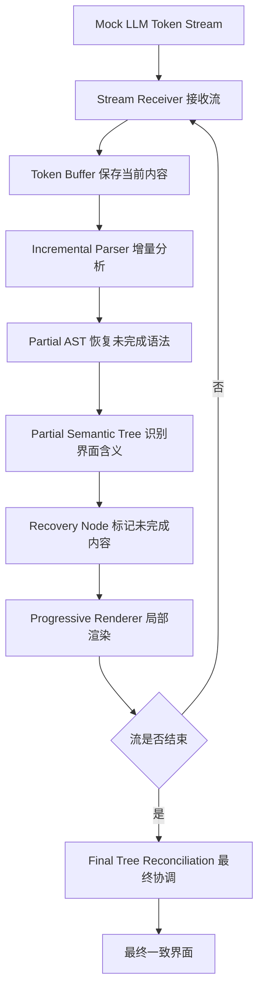
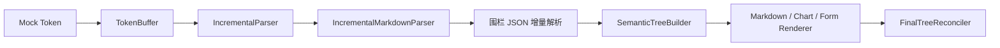

## 背景

大语言模型已经可以流式输出文本：模型生成一个词，页面就显示一个词。可一旦模型输出的不是普通文字，而是一段用于描述界面的 JSON、Markdown 或 DSL，事情就变得麻烦了。

例如，模型正在生成一个图表：

```json
{
  "component": "chart",
  "title": "月度销量",
  "data": [
    { "label": "1月", "value": 32 },
    { "label": "2月"
```

此时字符串、数组和对象都没有结束，传统 `JSON.parse()` 会直接失败。页面通常只能继续等待，直到模型把完整结构全部输出后，再一次性渲染。

但从人的角度看，上面的内容已经表达了不少信息：

- 这是一个图表；
- 标题已经确定；
- 1 月的数据已经完整；
- 2 月的数据还需要继续补充。

这个专利思路要解决的问题就是：**能否让系统也看懂这种“尚未完成、但已有部分含义”的结构，并提前把界面显示出来？**

## 核心思路

整个方案可以概括成一句话：

> 不等待完整结构，而是在 LLM 流式输出过程中持续恢复一个“临时界面结构”；确定的内容立即渲染，未完成的内容用骨架、占位或待补全节点表示，最终再与完整结构进行协调。

这里有几个看起来比较技术化、其实很直观的概念：

| 概念 | 简单理解 |
| --- | --- |
| 部分 AST | 先看懂当前文本的结构，即使 JSON 还没有闭合 |
| 恢复节点 | 给没生成完的地方加上状态标记，例如骨架、待补全或不完整 |
| 部分语义树 | 把文本结构进一步理解成图表、表单、列表等界面组件 |
| 渐进渲染 | 只把新到达或发生变化的内容更新到页面 |
| 最终树协调 | 模型输出完成后复用已有组件，只补齐差异，不把页面全部推倒重建 |

例如，前面的半截 JSON 可以被恢复成：

```text
Chart 图表节点【部分可渲染】
├── title：月度销量【已完成】
├── data[0]：1月，32【已完成】
└── data[1]：2月，?【待补全】
```

页面因此可以先显示图表骨架、标题和第一个数据点，等后续 token 到达后再补上第二个数据点。

## 整体流程



这不是简单地把“语义树”和“流式渲染”拼在一起。关键在于：这个中间结构允许不完整节点存在，并且每个节点都带有当前状态，系统可以据此判断它应该显示骨架、显示部分内容、保持等待，还是进入稳定状态。

## Demo 的实现方式

为了让这个思路容易理解，我实现了一个不依赖真实大模型的 React Demo。它使用 Mock Token Stream，把预先准备的内容拆成很多不完整片段，再按照一定速度逐个发送。

Demo 最终生成的是一篇 Markdown 文档。普通标题、段落和列表按照 Markdown 规则渐进显示；图表和表单则使用受控代码围栏描述：

````markdown
```chart
{"id":"sales-chart","title":"月度销量","data":[{"id":"jan","label":"1月","value":32}]}
```

```form
{"id":"lead-form","title":"预约试驾","fields":[{"id":"name","type":"text","label":"姓名"}]}
```
````

当 `chart` 这个围栏类型刚出现时，页面就会创建图表骨架；标题到达后更新标题；完整数据项到达后逐点追加。表单也是一样：先出现表单骨架，再逐个补充字段，用户已经输入的内容不会因为后续更新而丢失。

这里没有执行 Markdown 代码块中的任意 JavaScript，也没有使用 `eval`。渲染器只识别白名单中的 `chart` 和 `form` 声明式数据，并将其转换成预先实现好的 React 组件。

## Demo 架构

Demo 采用两层增量恢复：第一层恢复外部 JSON 和 Markdown 内容字符串，第二层恢复 Markdown 块以及图表、表单围栏中的声明式 JSON。



项目中的主要模块如下：

```text
src/
├── core/
│   ├── StreamReceiver.ts              # 接收 Mock token 流
│   ├── TokenBuffer.ts                 # 保存当前流式文本
│   ├── IncrementalParser.ts           # 恢复不完整 JSON
│   ├── IncrementalMarkdownParser.ts   # 恢复 Markdown 块和组件围栏
│   ├── SemanticTreeBuilder.ts         # 构建部分界面语义树
│   ├── RecoveryNodeFactory.ts         # 生成恢复节点状态
│   └── FinalTreeReconciler.ts         # 临时结构与最终结构协调
├── components/
│   ├── MarkdownRenderer.tsx           # 渐进渲染 Markdown
│   ├── ChartRenderer.tsx              # 渲染 SVG 图表
│   ├── FormRenderer.tsx               # 渲染并保持表单状态
│   └── DebugPanel.tsx                 # 展示 Buffer、树、状态和 Patch
└── mock/
    ├── mockDocument.ts                # 演示文档
    └── mockTokenStream.ts             # 模拟 LLM 流式输出
```

在页面右侧的调试区域中，可以直接观察 Token Buffer、增量语法状态、部分 AST、恢复节点、部分语义树以及最终协调 Patch 的变化。这也是这个 Demo 最重要的展示价值：它不只是表现“内容一个个出现”，而是把中间恢复过程直接可视化了。

## 可以看到什么

打开 Demo 并点击“开始演示”后，可以观察到：

1. Markdown 文档骨架首先出现；
2. 标题、段落和列表随着 token 到达逐步稳定；
3. 图表先显示骨架，再出现标题和数据点；
4. 表单先显示框架，再逐个补充字段；
5. 不完整内容会显示为 `PendingNode`、`SkeletonNode` 或 `IncompleteNode`；
6. 流结束后生成最终结构，并通过 Patch 复用已有组件。

与“每次拿当前字符串重新解析并全量刷新页面”相比，这种方式可以更早展示内容，减少页面闪烁和组件重建，并保留表单输入等交互状态。

## 当前 Demo 的边界

这个项目是为了说明原理而制作的最小 Demo，不是通用 JSON 修复库，也不是完整的 MDX 运行时：

- Token Stream 是 Mock 数据，没有调用真实 LLM；
- 只实现了受控 Markdown、Chart 和 Form 协议；
- Parser 只覆盖演示所需的 JSON 子集；
- 没有执行任意代码，所有可渲染组件均来自白名单；
- 重点是展示“不完整结构如何恢复并参与渲染”的核心流程。

## 体验与源码

- 在线 Demo：<https://llm-progressive-ui-demo.pages.dev/>
- GitHub 仓库：<https://github.com/tomorrowthief/llm-progressive-ui>

这套方案希望表达的并不是“让 JSON 提前通过解析”这么简单，而是让系统在 LLM 尚未完成输出时，就能理解已经确定的界面含义，并以可控、可恢复、可协调的方式逐步构建界面。

