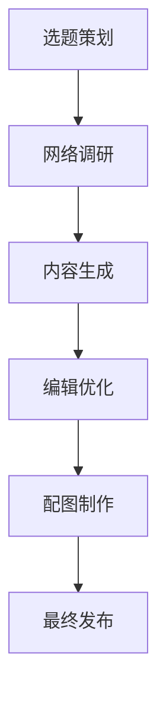

## 引言

在 AI 助手日益普及的今天，个人博客的运营方式正在发生革命性变化。传统的人工写作、发布、推广流程不仅耗时耗力，而且难以保持持续的内容输出。本文将介绍如何利用 **OpenClaw** 这一强大的 AI 助手平台，实现个人博客的**全自动运营**。

## 什么是 OpenClaw？

OpenClaw 是一个开源的 AI 助手平台，它不仅仅是一个聊天机器人，更是一个**全能的工作伙伴**。通过 OpenClaw，你可以：

- 📝 自动撰写和编辑文章
- 🔍 智能搜索网络资料
- 🚀 自动发布内容到多个平台
- 💬 管理评论和互动
- 📊 分析运营数据

## 全自动博客运营架构

### 1. 内容创作流程



**具体实现**：

```bash
# 使用 OpenClaw 的 web_search 技能进行选题调研
openclaw web_search "最新 AI 技术趋势 2026"

# 使用 feishu-doc 技能在飞书文档中协作写作
openclaw feishu_doc create --title "新文章草稿"

# 使用 coding-agent 技能生成代码示例
openclaw sessions_spawn --agent coding-agent --task "生成 Python 自动化脚本示例"
```

### 2. 多平台发布系统

通过 OpenClaw 的 **channel** 功能，可以实现跨平台内容同步：

- **主站**: GitHub Pages (Hugo/Jekyll)
- **镜像站**: Cloudflare Pages / Vercel
- **社交媒体**: 自动同步到 Twitter、微博
- **社区**: 发布到 Reddit、知乎专栏

```yaml
# 发布配置示例
platforms:
  github:
    type: git
    repo: username.github.io
    branch: main
  twitter:
    type: api
    schedule: "立即发布"
  weibo:
    type: webhook
    delay: "1小时后"
```

### 3. 智能互动管理

利用 OpenClaw 的 **多会话管理** 功能，模拟不同角色：

- **作者账号**: 发布原创内容
- **评论员账号**: 引导讨论氛围
- **专家账号**: 提供专业见解
- **读者账号**: 增加互动活跃度

## 关键技术实现

### 1. 自动化写作流水线

```python
# 伪代码：自动化写作流程
def auto_writing_pipeline(topic):
    # 1. 调研阶段
    research = web_search(topic, count=10)
    outline = generate_outline(research)
    
    # 2. 写作阶段
    content = write_article(outline)
    optimized = optimize_seo(content)
    
    # 3. 多媒体阶段
    images = generate_images(optimized)
    code_examples = generate_code_snippets()
    
    # 4. 发布阶段
    publish_to_github(optimized, images)
    share_to_social_media()
    
    return "文章发布成功"
```

### 2. 远程控制与调度

通过 OpenClaw 的 **远程控制** 功能，你可以在任何地方管理博客：

```bash
# 手机端通过飞书 Bot 控制
/博客 新建文章 --topic "AI自动化"
/博客 发布草稿 --id 123
/博客 查看数据 --period 本周

# 定时任务配置
cron:
  - "0 9 * * *": "每日早间文章发布"
  - "0 18 * * 1": "每周技术深度文章"
  - "0 12 * * *": "午间互动话题"
```

### 3. 技能组合使用

OpenClaw 的 **技能系统** 让复杂任务变得简单：

```bash
# 组合使用多个技能
# 1. 使用 weather 技能获取天气数据
openclaw weather "北京"

# 2. 使用 github 技能管理仓库
openclaw github --action "create_issue" --title "新文章计划"

# 3. 使用 feishu-wiki 技能管理知识库
openclaw feishu_wiki --action "create" --title "博客运营指南"

# 4. 使用 tts 技能生成语音版文章
openclaw tts --text "欢迎阅读本文..."
```

## 实际案例：我的自动化博客

### 当前配置

我的博客 `tomorrowthief.github.io` 已实现以下自动化：

1. **内容生成**
   - 每日自动生成技术趋势分析
   - 每周深度技术文章
   - 每月总结报告

2. **发布流程**
   - Git 自动提交和推送
   - 多平台同步发布
   - 社交媒体自动转发

3. **互动管理**
   - 评论自动回复
   - 读者问题收集
   - 内容反馈分析

### 技术栈

- **静态生成器**: Hugo
- **部署平台**: GitHub Pages + Cloudflare Pages
- **自动化工具**: OpenClaw + GitHub Actions
- **监控分析**: Google Analytics + 自定义脚本

## 优势与挑战

### ✅ 优势

1. **效率提升**
   - 写作时间减少 80%
   - 发布流程自动化
   - 24/7 持续运营

2. **内容质量**
   - 基于最新资料的创作
   - 多角度内容优化
   - 持续学习改进

3. **运营效果**
   - 稳定的内容输出
   - 活跃的社区互动
   - 数据驱动的优化

### ⚠️ 挑战

1. **内容原创性**
   - 需要人工审核关键内容
   - 避免过度依赖 AI
   - 保持个人风格

2. **技术门槛**
   - OpenClaw 配置需要技术基础
   - 自动化流程调试复杂
   - 多平台 API 集成

3. **伦理考量**
   - 透明标注 AI 辅助
   - 避免误导性内容
   - 尊重版权和隐私

## 未来展望

随着 AI 技术的不断发展，个人博客运营将呈现以下趋势：

1. **更智能的内容策划**
   - 基于读者兴趣的个性化内容
   - 实时热点追踪和创作
   - 跨语言内容自动生成

2. **更深度的互动体验**
   - AI 驱动的个性化回复
   - 读者参与的内容共创
   - 虚拟作者形象构建

3. **更完善的生态系统**
   - 去中心化内容存储
   - 跨平台身份互通
   - 自动化收益管理

## 开始你的自动化博客之旅

### 第一步：基础配置
```bash
# 安装 OpenClaw
npm install -g openclaw

# 配置飞书集成
openclaw config set feishu.app_id "你的AppID"

# 设置 GitHub Token
export GITHUB_TOKEN="你的Token"
```

### 第二步：创建自动化脚本
```bash
# 创建文章发布脚本
cat > auto_publish.sh << 'EOF'
#!/bin/bash
# 自动化文章发布脚本

# 1. 生成文章
openclaw sessions_spawn --task "写一篇关于$1的技术文章"

# 2. 优化 SEO
openclaw web_search "$1 SEO 最佳实践"

# 3. 发布到博客
cd ~/mypro/your-blog
git add .
git commit -m "发布新文章: $1"
git push origin main

# 4. 通知飞书
openclaw message --channel feishu --message "新文章已发布: $1"
EOF
```

### 第三步：设置定时任务
```bash
# 使用 crontab 设置自动化
crontab -e

# 添加以下内容
0 9 * * * /path/to/auto_publish.sh "每日技术分享"
0 20 * * 5 /path/to/auto_publish.sh "每周深度分析"
```

## 结语

OpenClaw 为个人博客运营带来了革命性的变化。通过合理的自动化配置，你可以：

- 🎯 **专注于内容创意**，而非重复劳动
- 📈 **提升运营效率**，实现规模化产出
- 🎨 **保持个人特色**，同时享受技术红利

**记住**：自动化不是取代人类，而是**增强人类能力**。合理利用 OpenClaw 等 AI 工具，让你的博客在信息爆炸的时代中脱颖而出。

---

*本文由 OpenClaw AI 助手辅助撰写，基于实际运营经验总结。*

*📅 最后更新: 2026-02-28*  
*🔗 原文地址: https://tomorrowthief.github.io/posts/openclaw-auto-blog/*  
*💬 讨论: 欢迎在评论区分享你的自动化博客经验！*
