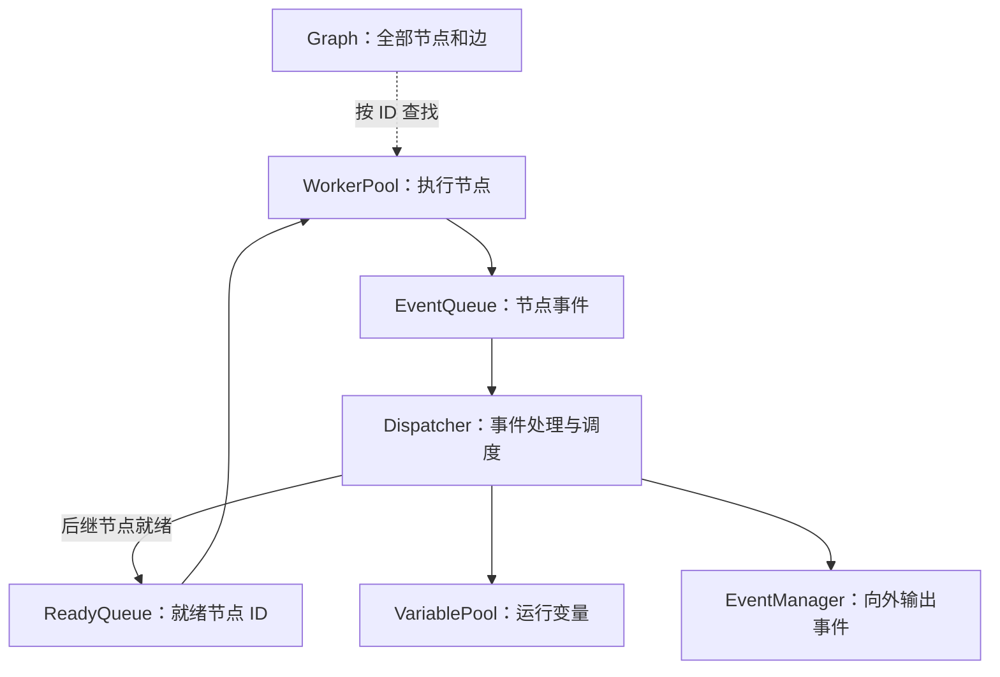
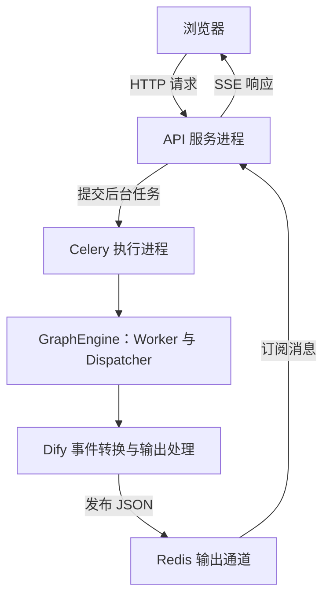
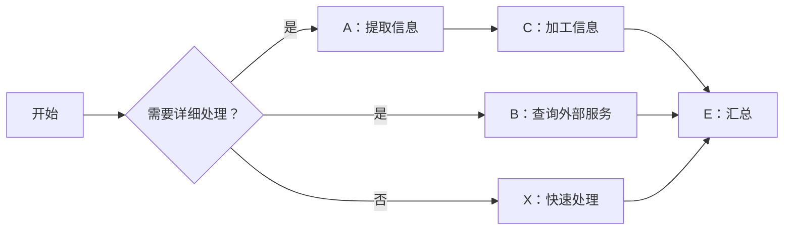

工作流画布上的节点和连线，很容易让人以为引擎只是“按顺序调用几个函数”。

真正运行起来以后，问题会复杂得多：哪些节点可以并行？条件分支没选中的路径怎么处理？两个分支什么时候汇合？节点失败后重试什么？等待人工确认时保存什么？后台执行和浏览器看到的进度是什么关系？

工作流引擎的价值，就在于把这些执行规则变成明确、可观察、可恢复的机制。

之前写过 [LangGraph 深度学习](/posts/ai-agent-langgraph/) 和 [Agent 的 HITL 设计](/posts/ai-agent-hitl/)。这次从 Dify 使用的 Graphon 入手，沿着一次运行追到队列、执行单元和事件，再比较 LangGraph 的底层。两者都能编排并行任务，但**后继节点何时启动、状态何时可见、故障后从哪里恢复**，存在值得认真理解的差别。

> 本文由 AI 辅助整理，依据实际源码阅读和最小示例验证形成。Graphon 部分基于本次阅读的 0.6.1 代码快照及其 Dify 集成，包含项目定制实现，不能直接代表所有 Dify 发布版本。LangGraph 的时序示例此前在 Python 版 LangGraph 1.2.12 中验证，底层解释以常规 StateGraph 的 Pregel 模型为准。文中的 3 秒与 4 秒是理想化时序推导，不是生产跑分；未对线上环境做吞吐量压测。

## 先分清平台与引擎

理解工作流，最好先把四层职责拆开：

| 层次 | 主要问题 | 典型内容 |
| --- | --- | --- |
| 图定义 | 要执行哪些步骤 | 节点、连线、条件、输入输出 |
| 执行调度 | 什么时候执行哪个节点 | 就绪判断、并行、汇合、重试 |
| 运行状态 | 已经执行到哪里 | 变量、执行记录、暂停状态、恢复快照 |
| 平台服务 | 如何让业务使用它 | API、鉴权、凭据、工具、日志、SSE |

**Dify 是应用平台，Graphon 是本次分析版本中的图执行引擎；LangGraph 则首先是一个可编程的图运行库。**

比较调度机制，应比较 Graphon 与 LangGraph。比较可视化编辑、发布、权限和运维成本，则应比较完整的平台方案。LangGraph 也有配套的服务与部署生态，不能把“核心库不包含”写成“整个生态没有”。

把完整 Dify 服务的请求延迟与关闭持久化的 LangGraph 本地脚本直接对比，测到的是两套不同系统的成本。

## Graphon 如何把图执行起来

Graphon 的核心组件之间，形成了一个持续反馈的执行过程：



图是静态结构，队列和状态随执行变化。几个名字看起来相似，实际上承担不同职责：

| 对象 | 保存什么 | 谁使用 |
| --- | --- | --- |
| `Graph.nodes` | 全部节点实例 | Worker 按 ID 查找节点 |
| `ReadyQueue` | 已满足条件、等待执行的节点 ID | Worker 获取任务 |
| Worker 当前任务 | 从队列取出的节点 | 当前执行单元 |
| `VariablePool` | 输入、节点输出等变量 | 节点读取，事件处理器更新 |
| 执行记录 | 执行 ID、状态、重试次数等 | 引擎跟踪和持久化 |
| `EventQueue` | 等待处理的节点事件 | Dispatcher |

节点不会从“全部节点池”搬到“已完成节点池”。节点实例一直留在 Graph 中，变化的是边状态、执行记录以及是否处于调度队列。

`VariablePool` 也不是线程池或连接池。这里的“池”表示变量容器；WorkerPool 才涉及执行资源的复用。

### 就绪队列在运行中增量产生

Graphon 没有先算出完整执行顺序，再逐项调用。正常启动时先把根节点入队；后续主要在处理节点完成事件时，检查受影响的后继节点。

边有三种状态：

- `UNKNOWN`：路径是否成立尚未确定。
- `TAKEN`：路径已经成立。
- `SKIPPED`：路径不会执行。

本次版本的就绪规则可以简化为：

```python
def is_node_ready(node):
    incoming = graph.get_incoming_edges(node.id)
    if not incoming:
        return True
    if any(edge.state == UNKNOWN for edge in incoming):
        return False
    return any(edge.state == TAKEN for edge in incoming)
```

它表达的是：**全部入边的状态都已经确定，并且至少有一条路径成立。**

为什么不能只等待“所有前驱节点都成功”？因为条件选择会让一部分前驱永远不执行。跳过传播必须把这些路径标记清楚，否则汇合节点会一直等下去。

`enqueue_node()` 负责入队，依赖判断在调用它之前完成。入队不等于完成，队列为空也不等于整张图结束：Worker 可能仍在执行已经取走的任务。

### Worker 复用执行单元

Worker 的源码继承 `threading.Thread`，核心逻辑可以抽象为：

```python
# 示意代码，省略上下文、钩子和异常处理
while not stopped:
    node_id = ready_queue.get(timeout=0.1)
    node = graph.nodes[node_id]
    for event in node.run():
        event_queue.put(event)
    ready_queue.task_done()
```

一个 Worker 执行完 A 后，可以继续获取 B。它与节点没有固定绑定。LLM 节点运行时可以不断产出 chunk 事件，但在本次 `node.run()` 结束前，这个 Worker 不会接下一个节点。

`get(timeout=0.1)` 表示队列为空时最多等待 0.1 秒，并不意味着每个任务固定增加 100 毫秒。任务已经在队列中时，可以立即获取。

本次源码的默认配置如下：

| 配置 | Graphon 自身默认 | Dify 装配时默认 |
| --- | ---: | ---: |
| 最小 Worker 数 | 1 | 3 |
| 最大 Worker 数 | 5 | 10 |
| 扩容队列阈值 | 3 | 3 |
| 缩容时间阈值 | 5 秒 | 5 秒 |

启动数量还与图规模有关：Dify 默认配置下，少于 10 个节点启动 3 个 Worker，10～49 个启动 4 个，至少 50 个启动 5 个。之后等待队列长度大于 3、且未达到上限时，每次扩容检查增加一个 Worker。

这些都是**每个 GraphEngine 实例**的设置，不是整个 Dify 的全局并发上限，也不是按 CPU 核数自动计算。

此外，`threading.Thread` 是源码层面的接口。Dify 的部分启动方式启用 gevent monkey patch，具体是否使用原生操作系统线程，需要结合宿主进程的启动方式判断。

### Dispatcher 把执行结果转成下一步调度

多个 Worker 可以同时产生事件，同一个 GraphEngine 的 Dispatcher 则逐个处理它们。

节点成功事件的主要处理顺序是：

```text
收到 A 的成功事件
  → 更新执行记录，累计用量
  → 将 A 的输出写入 VariablePool
  → 更新出边，处理条件分支和跳过传播
  → 判断后继是否就绪
  → 就绪节点入队，暂停时按相应路径登记待恢复状态
  → 完成 A 的执行跟踪
  → 收集对外事件
```

其他事件也有各自的处理方式：开始事件更新执行记录，流式 chunk 进入对外事件收集，变量更新事件修改变量池，失败事件根据策略进入重试、默认值、异常分支或失败处理。

Dispatcher 还会检查 WorkerPool 扩缩容和外部控制命令。它让运行状态的协调集中在一条处理链路里，也因此成为需要控制阻塞开销的位置。

## 外部能力与引擎怎样解耦

引擎需要支持 LLM、HTTP、工具、代码和文件节点，但调度器不应同时承担模型凭据、插件路由和存储服务的实现。

当前分析版本中，`DifyNodeFactory` 根据节点类型，通过构造参数注入所需依赖：模型工厂、HTTP 客户端、工具运行时、代码执行器、文件管理器等。不同节点获得自己需要的能力，并非每个节点都拿到所有依赖。

这里使用的是构造参数注入，不能照搬旧版本描述，统一写成 `_set_*` 类方法。

```text
Graphon
  节点执行协议、图状态、调度和事件

Dify 适配层
  租户凭据、模型供应商、插件、沙箱和存储
```

更换模型供应商不应改变就绪判断；修改文件存储不应改变并行规则。这种边界既便于测试，也让引擎能够脱离某一种平台基础设施复用。

## 从 HTTP 请求到浏览器事件

对于本次版本的后台流式执行路径，装配链路大致如下：

```text
HTTP 路由接收请求、鉴权和解析参数
  → AppGenerateService 选择工作流并提交后台任务
  → Celery 中的应用生成器与 Runner 准备运行环境
  → 创建 VariablePool、GraphRuntimeState 和 Graph
  → DifyNodeFactory 创建带外部依赖的节点
  → WorkflowEntry 创建 GraphEngine、命令通道和 Layers
  → 消费 engine.run()，启动实际执行
```

这里需要分清运行与展示两条路径：



HTTP 连接由 API 服务中处理该请求的进程持有。Celery 拿到的是任务参数，不会接收浏览器的 HTTP socket。

引擎内的事件也不会原样直接发到 Redis：

```text
NodeRunSucceededEvent
  → Dify 应用队列事件
  → {"event": "node_finished", ...}
  → JSON 序列化和 Redis 发布
  → API 接收并转换为 data: ...\n\n
```

**A 完成后 B 能否执行，由引擎内部状态决定，不需要等浏览器收到 A 的完成消息。** 普通节点之间的调度走内存队列，也不是每个节点都重新投递一个 Celery 任务。

### Redis Streams 不自动等于断线续传

输出通道可配置为 Pub/Sub 或 Streams，本次配置默认值为 Pub/Sub。Streams 实现通过 `XADD` 写入，订阅端通过 `XREAD` 读取；没有使用消费组来把节点任务分配给 Worker。

是否能够回放，取决于读取游标。当前阅读版本的订阅从 `$` 开始，也就是等待新的消息，不会自动读取已经存在的记录。因此，不能仅凭底层选了 Redis Streams，就认为首条事件不丢、断线续传或至少一次交付已经完整实现。[Redis XREAD 官方说明](https://redis.io/docs/latest/commands/xread/)

反方向的控制命令另走命令通道。本次 Graphon 的 `RedisChannel` 使用 Redis List 发送和提取命令，与输出 Stream 是不同机制。

### 业务完成和 HTTP 响应结束是两个时刻

Dify 会先输出类似下面的业务事件：

```text
data: {"event":"workflow_finished","data":{"status":"succeeded"}}

```

随后响应生成器结束，HTTP 服务器结束本次响应体。前端 `reader.read()` 返回 `done: true`，表示响应体已经读完，不一定表示 TCP 连接已经关闭。

SSE 没有规定统一的“整个流结束”消息，`workflow_finished` 或 `[DONE]` 都是应用层约定。原生 `EventSource` 还有重连行为，需要与业务结束配合处理；这里讨论的前端路径采用响应体 reader 读取。[SSE 标准](https://html.spec.whatwg.org/multipage/server-sent-events.html)

执行记录、Redis 消息和 SSE 都有用途，但它们不能互相替代，更不能自动替代引擎恢复快照。

## LangGraph 如何通过超步推进

LangGraph 常规 StateGraph 的底层运行模型基于 Pregel。它也支持并行，只是执行围绕 superstep，也就是超步展开。

```text
Plan：确定本步执行的节点
  ↓
Execution：并发执行本步任务
  ↓
Update：合并本步写入，更新状态通道
  ↓
下一步
```

在执行阶段，本步节点产生的状态写入不会立即对同一步其他节点可见。普通后继通过下一超步推进。[Pregel 官方说明](https://reference.langchain.com/python/langgraph/pregel/main)

底层的 Channel 是运行时状态与更新规则的抽象，不必理解成 Redis 消息通道。StateGraph 的节点读 State，返回部分更新；编译后的任务与通道负责把这些更新和下一步触发联系起来。

| 问题 | Graphon | LangGraph 常规 StateGraph |
| --- | --- | --- |
| 后继何时调度 | 完成事件被处理，依赖满足后即可入队 | 当前超步结束、更新状态后推进 |
| 主要协调单位 | 节点事件、边状态 | 超步、任务、状态通道 |
| 汇合依据 | 入边全部确定且至少一条成立 | 边及显式汇合声明形成的触发条件 |
| 运行数据 | VariablePool 和节点输出引用 | State 字段、Channel 和 reducer |

差异的核心是**并行任务如何推进以及结果何时可见**，不是“谁支持并行、谁不支持”。

## 同一张图的两种执行时间线

下面这张图同时包含条件、并行与汇合：



详细路径中，A 与 B 并行，C 只依赖 A，E 等待 B 和 C。快速路径只执行 X，然后进入 E。

假设 A 为 1 秒、B 为 3 秒、C 为 1 秒；忽略其他节点和框架开销，且并发资源足够。

### Graphon 的依赖就绪调度

```text
时间    0       1       2       3 秒
A       [-------]
C               [-------]
B       [-----------------------]
E                               开始
```

A 完成后，C 就能开始，不必等 B。未选择的 X 路径会通过跳过传播排除，E 等 B 和 C 完成即可。

理想耗时是：

```text
max(A + C, B) = max(1 + 1, 3) = 3 秒
```

### LangGraph 常规 StateGraph 的超步边界

```text
超步 1：A、B 并行；1 秒时 A 完成，3 秒时 B 完成
超步 2：C 在 3 秒时开始，4 秒时完成
超步 3：E 开始
```

这张图按上述同层方式建模时，C 属于下一步，会等当前超步完成。

```text
max(A, B) + C = max(1, 3) + 1 = 4 秒
```

这是调度语义示例，不能据此宣称 Graphon 在所有场景快 25%。实际运行还有持久化、资源竞争和节点实现等成本。

建模方式也会改变边界。比如把 A→C 放进一个节点或子图，使它作为一条内部执行链与 B 并发，可以改变等待关系；代价是需要重新考虑节点可观测性、子图状态和恢复粒度。

### 汇合声明不能只看画出来的连线

LangGraph 中，上图的关键连线可以表达为：

```python
# 片段：假设 State 和所有节点函数已经定义
builder.add_conditional_edges(
    "Q",
    lambda state: ["A", "B"] if state["detailed"] else ["X"],
)
builder.add_edge("A", "C")
builder.add_edge(["B", "C"], "E")
builder.add_edge("X", "E")
```

`add_edge(["B", "C"], "E")` 明确表达等待两者到达。分别添加 `B→E` 和 `C→E`，在前驱处于不同超步时，不能等价理解成同一个 AND 汇合。

两套引擎能画出类似的图，但边的运行含义仍需要分别确认。

## 状态与动态任务的设计差异

### 节点输出引用与共享状态合并

Graphon 更自然的使用方式是按节点引用输出，例如 `A.result`、`B.result`。后继节点按配置读取变量，数据来源与画布节点对应，适合可视化映射。

LangGraph 的节点通常返回 State 的部分更新：

```python
def node_a(state):
    return {"results": ["A 的结果"]}
```

多个节点需要汇总到同一个字段时，可以给字段定义 reducer：

```python
from typing import Annotated, TypedDict
import operator

class State(TypedDict):
    results: Annotated[list[str], operator.add]
```

reducer 决定已有值和本次更新如何合并。同一步多个节点更新普通单值字段时，不能简单理解成“谁最后完成就覆盖谁”；需要符合通道允许的更新方式。[LangGraph State 与 reducers](https://github.com/langchain-ai/docs/blob/main/src/oss/langgraph/graph-api.mdx)

按节点命名输出，更容易追踪画布上的数据来源；共享状态与 reducer，更适合积累消息、任务结果和 Agent 状态。自定义合并逻辑仍然要考虑顺序、重复写入和业务幂等，框架不会替开发者决定这些语义。

### 动态派发与循环

Dify 通常先定义画布，再通过条件节点选择路径，通过迭代和循环容器执行子图。运行时列表长度可以变化，但处理方式仍由预先配置的容器表达。

LangGraph 可以通过条件边、循环回边、`Send` 和 `Command` 表达动态控制。比如任务数量由运行时输入决定：

```python
from langgraph.types import Send

def dispatch_documents(state):
    return [
        Send("process_document", {"document": doc})
        for doc in state["documents"]
    ]
```

`Send` 为目标节点提供各自的输入，适合动态 map-reduce；节点返回的 `Command` 则可以同时更新状态并表达路由。[LangGraph 动态任务说明](https://github.com/langchain-ai/docs/blob/main/src/oss/langgraph/graph-api.mdx)

这种差异主要是表达能力的组织方式：Dify 偏向可配置节点和容器，LangGraph 偏向代码中的运行时控制。不能把它简化为 Dify 完全静态、LangGraph 才能处理动态列表。

## 暂停恢复到底保存了什么

Graphon 的运行状态可以序列化变量、就绪队列、图执行记录、节点和边状态，以及暂停和延后执行的节点。Dify 再通过外层流程保存这些状态，并在恢复时重新装配引擎。

但三个能力应分开看：

1. 记录节点开始、结束和输出，用于查询与审计。
2. 在约定暂停点保存快照，用于人工介入后恢复。
3. 在任意进程故障后，按明确的持久化边界恢复。

具备前两项，不自动等于第三项。能序列化运行状态，也不代表每个节点结束后都保存了一个持久检查点。

LangGraph 将 checkpointer 作为运行时的明确接口。启用后，超步边界可以形成状态快照，步内成功任务的 pending writes 则用于失败恢复，避免同一步中已经保存成功结果的任务无谓重跑。历史检查点还支持查看、回放和分叉。[LangGraph Checkpointers](https://docs.langchain.com/oss/python/langgraph/checkpointers)

持久化的成本与故障窗口仍取决于配置：

| 模式 | 保存时机 | 需要考虑的取舍 |
| --- | --- | --- |
| `sync` | 下一步开始前同步保存 | 将存储延迟放入推进路径 |
| `async` | 下一步执行时异步保存 | 有进行中的持久化窗口 |
| `exit` | 图退出时保存 | 不具备同等的中途故障恢复粒度 |

这些是 LangGraph 的 durability 选项；是否持久可靠，还取决于 checkpointer 后端，内存保存器不能跨进程重启保存数据。[Durability 参考](https://reference.langchain.com/python/langgraph/types/Durability)、[Persistence 文档](https://docs.langchain.com/oss/python/langgraph/persistence)

### 恢复不会自动冻结和还原 Python 调用栈

LangGraph 的 `interrupt()` 恢复时，会从发生中断的节点函数开头重新进入。中断前的代码可能再次执行，恢复值再成为中断调用的返回值。因此，中断前的外部副作用需要幂等设计。[Interrupts 文档](https://docs.langchain.com/oss/python/langgraph/interrupts)

Graphon 的恢复也依赖节点协议与已保存状态，不能假设某个线程会永久停在一行代码上，重启后继续。

两者都不能仅靠“工作流可以恢复”，就保证订单创建、通知发送等外部动作恰好执行一次。外部动作成功但状态尚未保存时发生故障，仍需要幂等键、业务记录或结果核对来判断是否重做。

## 性能应该怎样比较

性能至少包含三个问题：单次工作流多久完成、系统能同时承受多少工作流、用户多久看到第一个有效输出。

### 图结构和节点粒度决定单次延迟

Graphon 的依赖就绪调度，有利于快分支继续向下推进。LangGraph 的超步提供明确的状态更新阶段，但在同层分支耗时不均时，下一步可能等待慢任务。

如果节点只执行极小的数据转换，调度、状态记录和持久化可能比计算本身更贵。反过来，一个需要数秒的模型请求，其耗时可能主要来自供应商排队、首 token 和生成过程。

这两类场景不能使用相同的优化思路。减少一个字符串处理节点和减少一次模型调用，通常不是同一个数量级的问题。

LangGraph 也能在节点运行过程中流式输出模型 token。超步屏障约束状态推进，并不意味着所有 token 都要等整步结束后才展示。[LangGraph 官方流式能力示例](https://github.com/langchain-ai/streaming-cookbook)

### 当前实现中值得测量的三个位置

本次代码阅读发现的关注点如下，它们是特定快照的实现观察，并非跨版本的性能结论：

| 位置 | 可能造成的影响 |
| --- | --- |
| Dispatcher 同步调用持久化 Layer | 存储调用慢时，后续事件可能积压 |
| 重试处理直接等待重试间隔 | 同一 Dispatcher 的其他事件暂时无法处理 |
| 事件队列等待超时后额外 sleep | 新事件恰好到来时，增加调度等待 |

`EventManager.collect()` 直接调用 Layer 的 `on_event()`，并不自动把持久化转为后台任务。若 Repository 同步调用远程存储，就可能延长事件处理链路。当前项目有这类定制实现，但不能据此断言所有 Dify 部署都走相同存储路径。

重试也需要看底层位置。如果等待发生在 Dispatcher 的处理函数里，其他 Worker 即使完成了任务，它们的事件仍可能需要等这段重试间隔结束。gevent 可以让其他执行单元运行，却不会让同一个 Dispatcher 同时继续执行下一条事件。

提高 Worker 数量，解决不了这些串行处理点。

### 并发上限与系统吞吐是不同层次

图内节点并发、迭代内部并发、同时运行的工作流数量，以及模型与数据库的连接容量，都有各自的限制。嵌套使用时，总资源需求可能远高于一个 `max_workers` 参数给人的直觉。

LangGraph 的异步调用接口也不等于没有超步屏障。使用异步 I/O 可以改善等待时的资源利用，不能改变图本身的依赖规则。两套引擎中的并发，都不应直接解释为 CPU 密集任务的多核加速。

如果生成事件的速度长期高于消费速度，还需要观察事件队列和运行记录占用。缓冲让执行与展示解耦，但缓冲本身会消耗内存；是否有边界和背压，要检查具体实现。

### 公平压测需要对齐工作负载

| 维度 | 应保持一致的条件 |
| --- | --- |
| 图结构 | 分支、依赖和汇合语义相同 |
| 节点工作 | 相同模型、工具或模拟延迟 |
| 并发 | 相同的有效并发额度 |
| 持久化 | 相近的恢复保证和存储条件 |
| 可观测性 | 相近的日志与追踪等级 |
| 环境 | 相同机器、网络、连接池和供应商限流 |

可以分别测试串行小节点、不均衡并行分支、大量动态任务、流式输出、失败重试和恢复。

除了总耗时，建议记录：

- 后台任务提交到开始执行的等待。
- 节点入队到 Worker 取走的等待。
- 节点实际执行时间。
- 完成事件入队到 Dispatcher 处理的等待。
- 持久化耗时和事件缓冲长度。
- 首个有效 token、端到端 P50/P95 和资源使用。

尤其值得观察“前驱已经完成，后继为何还没开始”这段空档。它能帮助区分依赖屏障、执行容量不足和事件处理堵塞。

## 功能与适用场景对比

下面是基于上述机制的工程判断，不是产品能力的绝对边界。

| 维度 | Dify＋Graphon | LangGraph |
| --- | --- | --- |
| 流程表达 | 画布与节点配置，代码节点补充 | 代码定义状态、节点、边与路由 |
| 并行推进 | 依赖满足后增量调度 | 常规 StateGraph 按超步推进 |
| 数据组织 | 节点输出引用与 VariablePool | State、Channel 与 reducer |
| 动态任务 | 条件、迭代、循环和子图 | Send、Command、循环和子图 |
| 外部能力 | 平台统一提供模型、凭据、工具和文件能力 | 开发者组合函数、客户端和集成 |
| 暂停恢复 | 快照与平台保存恢复流程协作 | checkpointer、interrupt 与恢复命令 |
| 历史调试 | 取决于具体记录和恢复实现 | checkpoint 历史、状态修改与分叉机制明确 |
| 产品交付 | 编辑、调试、发布能力集中在平台 | 自行建设服务层或使用配套平台 |
| 调优重点 | 引擎、平台和基础设施一起观察 | 节点代码、图边界、状态与持久化策略 |
| 工程成本 | 平台部署、扩展和版本维护 | 自建部分的服务化、权限、凭据与运维 |

### 什么时候更适合 Dify

需要快速交付可配置的 AI 应用，业务人员会参与调整流程，模型、工具和知识库需要统一管理时，Dify 的平台能力可以减少重复建设。

流程较稳定、节点能力与平台已有抽象契合时，使用现有节点和明确的数据映射通常更省维护成本。运行时的一部分额外工作，也是在支持记录、调试与治理。

### 什么时候更适合 LangGraph

应用核心是高度定制的 Agent 行为，任务数量和下一步路由经常在运行时决定，状态合并、人工介入和历史恢复需要由代码精确表达时，LangGraph 更容易直接进入业务程序的控制流。

团队愿意建设或采用配套运行平台，换取对节点实现、图边界和持久化策略的控制。这种选择并不免除平台成本，只是让团队决定哪些能力自行实现、哪些依赖生态。

### 组合使用时要明确恢复边界

也可以由 Dify 编排外层业务流程，把复杂 Agent 包装成独立服务，由 LangGraph 执行。

这种组合保留了画布和代码编排各自的优势，但需要明确超时、取消、幂等、追踪和恢复归谁负责。特别是两层同时重试时，不能让同一个外部动作被不知情地重复执行。

选型时，先回答三个问题：**流程由谁维护，状态需要怎样恢复，主要耗时发生在哪里。** 这三个答案，往往比“是否支持并行”或“哪个框架更快”更能决定系统最终是否好用。

## 源码阅读索引

下面是本次 Graphon 0.6.1 快照的定位入口。路径属于所分析的代码布局；[Dify 官方仓库](https://github.com/langgenius/dify)后续拆包或发布版本可能采用不同目录，不能把这些路径当成所有版本都有效的链接。

| 阅读目标 | 本次源码位置 |
| --- | --- |
| 引擎装配与生命周期 | `graphon/src/graphon/graph_engine/graph_engine.py` |
| 就绪判断 | `graphon/src/graphon/graph_engine/graph_state_manager.py` |
| Worker 执行循环 | `graphon/src/graphon/graph_engine/worker.py` |
| Worker 池与扩缩容 | `graphon/src/graphon/graph_engine/worker_management/worker_pool.py` |
| Dispatcher 循环 | `graphon/src/graphon/graph_engine/orchestration/dispatcher.py` |
| 事件处理与对外输出 | `graphon/src/graphon/graph_engine/event_management/` |
| 运行状态快照 | `graphon/src/graphon/runtime/graph_runtime_state.py` |
| Dify 依赖注入 | `api/core/workflow/node_factory.py` |
| Dify 引擎装配 | `api/core/workflow/workflow_entry.py` |
| 后台任务与 Redis 发布 | `api/tasks/app_generate/workflow_execute_task.py` |
| Redis 消息订阅循环 | `api/core/app/apps/streaming_utils.py` |
| SSE 编码与 HTTP 响应 | `api/core/app/apps/base_app_generator.py`、`api/libs/helper.py` |

阅读时可以先跟一条最简单的串行路径，再加入条件分支与并行汇合，最后研究暂停、失败和流式输出。每增加一种能力，都观察它改变了什么状态、产生什么事件，以及由谁决定下一步执行。
